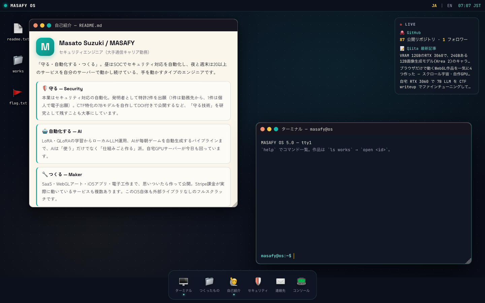
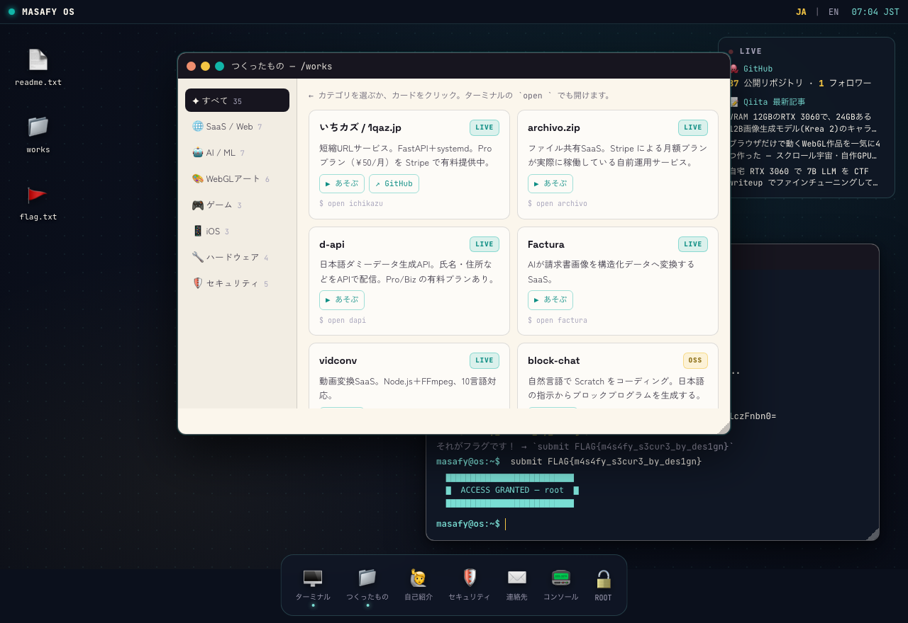
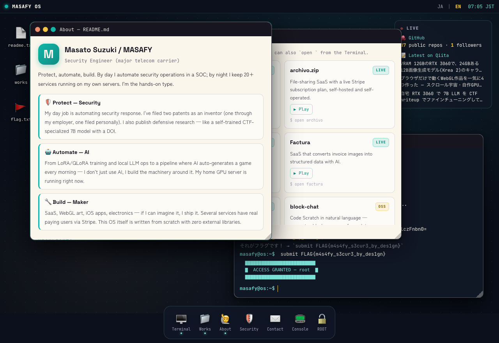
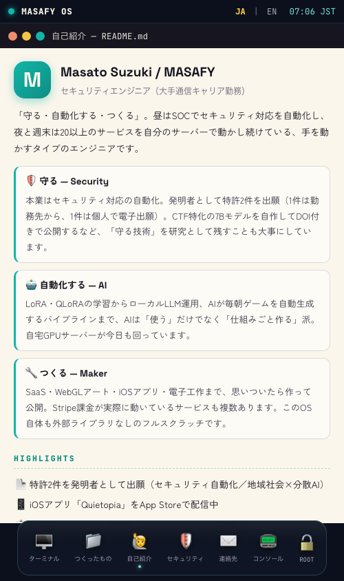

# 🖥️ MASAFY OS

> ブラウザで起動する、操作できるポートフォリオOS。

アクセスするとBIOS風のブートシーケンスが走り、架空のOS「MASAFY OS」が立ち上がる。ウィンドウを開き、ターミナルにコマンドを打ち、Masato Suzuki (MASAFY) の作品と経歴を自分の手で探検するポートフォリオサイト。外部ライブラリゼロ、vanilla JS フルスクラッチ。

   

🔗 **[https://os.1qaz.jp](https://os.1qaz.jp)**

---

## 📸 スクリーンショット



| つくったもの（Works） | English | Mobile |
|---|---|---|
|  |  |  |

---

## 🎮 操作方法

| 操作 | 動作 |
|---|---|
| Dock のアイコン | アプリ（ウィンドウ）を開く |
| ウィンドウのタイトルバー | ドラッグで移動 |
| 右下ハンドル | リサイズ |
| ⬤⬤⬤ ボタン | 閉じる / 最小化 / 最大化 |
| メニューバー JA / EN | 日英切替（保存される） |

### ターミナルの主なコマンド

| コマンド | 動作 |
|---|---|
| `help` | コマンド一覧 |
| `whoami` | 自己紹介 |
| `ls works` | 全作品の一覧 |
| `open <id>` | 作品やアプリを開く（例: `open voyage`） |
| `neofetch` | システム情報 |
| `nmap` | ポートスキャン……？ 🚩 |

> 🚩 このOSにはCTFフラグが1つ隠されています。見つけた人だけが開ける画面があります。

---

## ✨ 特徴

- **ウィンドウマネージャ自作** — ドラッグ・リサイズ・最小化/最大化・フォーカス管理まで全部手書き
- **本当に打てるターミナル** — コマンド履歴（↑↓）、20以上のコマンド、隠しCTFフラグ
- **ライブウィジェット** — GitHub API と Qiita API から実データを取得する「生きてる」デスクトップ
- **日英バイリンガル** — 辞書方式のi18n、localStorage永続化
- **可観測性もデザイン** — OS自身のイベントログが流れるコンソールアプリ
- **外部ライブラリゼロ** — フレームワークなし、ビルドなし、`index.html` を開けば動く

---

## 🛠️ 技術スタック

| カテゴリ | 技術 |
|---|---|
| フロントエンド | HTML / CSS / JavaScript (Vanilla, ES2020) |
| フォント | Space Grotesk / JetBrains Mono / Zen Kaku Gothic New (Google Fonts) |
| ライブデータ | GitHub REST API / Qiita API v2 |
| ホスティング | VPS + nginx + Let's Encrypt |

---

## 📁 ディレクトリ構成

```
masafy-os/
├── index.html        # エントリポイント（OGP / JSON-LD 込み）
├── css/os.css        # デスクトップ・ウィンドウ・Dock・全アプリのスタイル
├── js/
│   ├── data.js       # 作品データ35件 + 日英i18n辞書
│   ├── apps.js       # About / Works / Security / Contact / Console / ROOT
│   ├── terminal.js   # ターミナル本体 + CTF
│   └── os.js         # ブート / ウィンドウマネージャ / Dock / ウィジェット
└── assets/og.jpg     # OGPシェアカード
```

---

## 🚀 セットアップ

```bash
# クローンして開くだけ（ビルド不要）
git clone https://github.com/masafykun/masafy-os.git
cd masafy-os

# そのままブラウザで index.html を開く、または
python3 -m http.server 8080
# → http://localhost:8080
```

---

## ライセンス

[](https://opensource.org/licenses/MIT)

このプロジェクトは **MIT ライセンス** のもとで公開しています。

© 2026 masafykun (https://github.com/masafykun)
